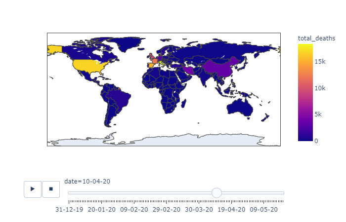
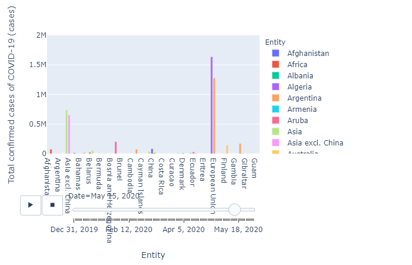
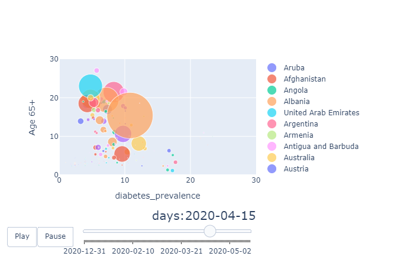

# __Final DSP Project__

## _Problem 1_ __Data visualization__

- ### I left the Jupytet Notebook version along with the python files
- ### I combined some of the excel files to get the information needed
* ### Please make sure to change the file path of the excel sheet in the 4 questions in jupyter notebook
### part a
* ### xaxis = total_deaths
* ### yaxis = total_recovered
* ### bubble size= cases
  

### part b
* ### deaths in each country 
  
### part c
* ### xaxis = countries
* ### yaxis = cases
  
### part d
* ### xaxis = diabetes_prevalence
* ### yaxis = Age 65+
* ### bubble size= cases
  

#
# ps: Don't forget to change the file path in jupyter nootbook

